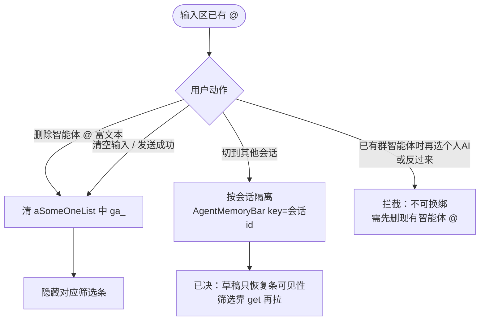

# Spec：at个人AI框（先做 PC）

> 最后更新：2026-07-28  
> 状态：**PC Task 1–8 已落地（待 E2E）；见 status.md / impl-notes.md**

## 目标

群聊输入框可 `@个人AI框`；选定后在输入区上方展示与 web 个人 AI `FilterBar` **普通筛选模式**对齐的筛选条。本期先 PC。`group/get` · `groupAgentRels.accountId` 与个人 AI `getAgentDataRange` 均已实测可用。

## 已决

| 项 | 结论 |
|----|------|
| 场景 | **只做群聊** `@`（对齐现有 `@智能体`）；私聊不在本功能范围 |
| 互斥 | 群智能体与个人 AI 框同时只能 `@` 一个 |
| 不可重复 | 同一条输入里智能体（群或个人）合计最多一个；**已有智能体 `@` 后再输 `@`：候选人列表中不显示群智能体/个人 AI**（仍显示所有人、群成员，可继续 `@人`） |
| 工具栏「@智能体」 | **只插群智能体**（现网行为不变）；不插个人 AI |
| 回复 + `@` | **需要**：右键回复后，可再 `@` 群智能体或个人 AI；发送时带 `referUuid`（对齐现网群智能体） |
| 落点 | 输入区上方筛选条位置同现网。群智能体**主流程不变**，但有两处必须一起动：① 共享判断点改造（见下节）；② `aiRobtChat` 补传 `agentId`（群也要传）。另胶囊文案统一改「类型+N」 |
| 隔离约束 | 个人 AI 逻辑与群智能体**分支隔离**：共享点一律按 `agentKind` 走两条分支，不允许在群分支里夹带个人 AI 的字段或请求 |
| 类型区分 | **不能只靠 `ga_` 前缀**——个人 AI 的 `agentAccountId` 同样是 `ga_` 开头。判别位取 `groupAgentType`：群=`3`（`groupAgentRel`）；个人=`0`（`groupAgentRels`）。插入 `@` 时在 `aSomeOneList` 项上带 `agentKind: 'group' \| 'personal'`，后续所有分支只认这个字段 |
| 筛选 UI（个人 AI） | PC **全新实现**。web 只作**视觉样式与选择交互**的参考，**不移植其组件、不移植其判断逻辑**。构成：知识类型 + 人/群 DataScope + 时间。**联网**沿用 PC 现有胶囊；**深思本期无 UI**，按 get 回参原样透传回存 |
| DataScope 显示条件 | PC 自行判定，**不要搬 web 的 `shouldShowDataScopeBar`**。个人 AI 筛选条在 PC 是独立组件、只在 `@` 个人 AI 时挂载，「是个人 AI」由挂载条件保证，**组件内只判一条：勾选含 `1` / `2` / `4` 任一**（实测默认 1/2/3/4 全选，故初次进入即显示）。<br>补注：web 多一层 `belongType === 0`，是因为它的 `FilterBar` 被个人 AI 框与群 AI 框共用、需在运行时排除群；PC 没有这个共用前提。照抄会因群聊 `belongType=3` 而永远不显示 |
| DataScope 空态 | 实测 `dataRangeScopeList: null` → 按空数组；胶囊显示「数据+0」，点开再选人/群；`saveDataRange` 须回传列表 |
| DataScope 选择上限 | **无上限**（不沿用转发弹窗的 9 个限制） |
| 胶囊文案 | 知识类型胶囊 **「数据+N」→「类型+N」**；DataScope 胶囊保持「数据+N」。**群智能体记忆条同步改**，两处叫法一致——属用户可感知变更，需告知测试 |
| getAgentDataRange（个人 AI） | **入参优先 `accountId` + `agentId`**（`agentId` 取自匹配到的 `groupAgentRels[].agentId`）；回参见下表「实测回参」 |
| 知识类型（个人 AI 实测） | 仅 4 项、**无 type=0 内置知识库**：`3` 个人知识、`4` 群聊私聊知识、`1` 群聊私聊记录、`2` 群聊私聊文件（默认均 `choose=1`） |
| 时间 / 联网 / 深思（实测） | 默认 `timeType=7`（近一周）；`timeInfoList` 含 type 2–20；`netSearch=0`、`deepThink=0`；`knowledgeNeedAuthList=[]` |
| 不做的 web 支路 | PC 新写，天然不含 `MsgRangeBar` / `MailSelector`，本期也不补 |
| `@` 群智能体 | 交互流程不变，筛选条继续走现 `AgentMemoryBar`。但**本期会动到群路径三处**：共享判断点分流、`aiRobtChat` 补传 `agentId`、胶囊文案改「类型+N」。改完须回归群智能体主流程（`@` → 改筛选 → 发送 → AI 回复） |
| 筛选记忆逻辑 | **与现网群智能体 `AgentMemoryBar` 一致**：筛选条出现时拉 `getAgentDataRange`；用户改类型/时间/联网/深思（及个人 AI 的 DataScope）即触发 `saveDataRange`；`agentId` 取自 get 回参顶层；隐藏/重置行为对齐现网（不另发明草稿内嵌记忆） |
| 数据写回 | `saveDataRange`；个人 AI **每次保存都带全量载荷**（含当前 `dataRangeScopeList`，null 当 `[]`），避免改知识类型时被后端按覆盖语义清空已选人/群；群智能体路径的保存载荷与调用时机**不动** |
| 发送载荷 | `POST /v1/aiRobtChat`（IM 发送成功后由 `messageService` 回填 `msgUID` / `objName` 再调）。**2026-07-28 已决**：<br>· `agentId` **群和个人都必传**；个人取 `groupAgentRels[].agentId`，群取现有 `chat-box.agentMemoryAgentId`（即 `getAgentDataRange` 回参顶层 `agentId`），`send-box` 经 `$parent` 取<br>· `aiRoleId` **两边都继续传 `'1'`**——后端靠 `agentId` 即可判定智能体身份<br>· `dataRangeScopeList` 仅个人 AI 带 |
| 回复可见性 | 个人 AI 的回复**群内其他人可见**（与群智能体一致，非私密回复） |
| 与群 AI 框 / AI 框分析 | 不做互斥或联动处理。筛选态一律由记忆接口（get / save）驱动，极端并发场景本期不考虑 |
| 群智能体来源 | `POST /api/chat/v1/group/get`：`groupAgentRel` = 群；`groupAgentRels[]` = 个人 |
| `@` 弹窗列表 | 所有人、群智能体、**仅** `accountId === 当前登录人` 的个人 AI、群成员 |
| 消息发送人回显 | 按 `agentAccountId` 匹配 → `agentName` / `agentAvatar` |
| 只 @ 自己 | `groupAgentRels[].accountId === 当前登录人`（已实测） |
| Mock | `@` 列表 / 记忆拉取均可走真实接口；本地假数据仅作联调兜底 |
| 范围 | 本期只 PC |
| 节奏 | 规格 + 计划已就绪；按 `plan.md` 开发 PC |

## 共享代码改造点（PC · 必须逐项分支）

> 现网**唯一**的智能体判据是 `id.startsWith('ga_')`，而个人 AI 的 `agentAccountId` 同样是 `ga_` 前缀。
> 若不改造，个人 AI 一旦进入 `aSomeOneList`，会直接点亮现网群智能体记忆条、并发出参数错误的 `getAgentDataRange`。
> 因此「群智能体零改动」不成立；正确的目标是**群智能体行为不变**，改造点逐个按 `agentKind` 分流。

| 文件 | 行 | 现状 | 改造要求 |
|------|----|------|----------|
| `send-box.vue` | 475 | `hasAgentMention` 用 `ga_` 前缀判断 | 拆成 `hasGroupAgentMention` / `hasPersonalAgentMention`，均按 `agentKind` |
| `send-box.vue` | 526 / 1017 | 直接写 `$parent.agentMemoryBarVisible` | 分别驱动群筛选条 / 个人 AI 筛选条两个可见性 |
| `send-box.vue` | 563 / 982 | 草稿恢复按 `ga_` 前缀过滤 | 恢复时保留 `agentKind`；草稿里没有该字段的旧数据按群兜底 |
| `send-box.vue` | 761 | `peopleList` 里按 `ga_` 挑智能体 | 按 `agentKind` 区分；已有智能体时两类都不进候选 |
| `send-box.vue` | 1415 | `atUserList` 的 `isAgent` 判断 | 个人 AI 同样按智能体规则取 `atUserName`，勿走真人分支 |
| `send-box.vue` | 1442 | 收集 `_agentIds` 并组 `agentChatData`，无 `agentId`、`aiRoleId` 写死 `'1'` | **两条分支都补 `agentId`**（群取 `$parent.agentMemoryAgentId`，个人取 `groupAgentRels[].agentId`）；`aiRoleId` 维持 `'1'`；个人分支额外带 `dataRangeScopeList` |
| `agent-memory-bar.vue` | 24 | 知识类型胶囊文案「数据+N」 | 改「类型+N」，与 DataScope 胶囊区分（群侧同步生效） |
| `chat-box.vue` | 120–126 | `AgentMemoryBar` 单实例，`:key` 只按会话 id | 个人 AI 用**独立组件实例**，不与群共用 `ref` |
| `chat-box.vue` | 2004 | `fetchAgentMemorySettings` 用 `belongId`/`belongType=3`/`aiRoleId` | 个人 AI 走 `accountId` + `agentId`，另起方法，勿改群参数 |
| `chat-box.vue` | 2043 | `saveAgentMemory` 用共享 `agentMemoryAgentId` | 个人 AI 的 agentId / scopes 独立存放 |

## 用户流程（草案）

### 总览：入口 → 选中 → 筛选 → 发送

```mermaid
flowchart TD
  START([群聊输入区]) --> ENTRY{用户动作}

  ENTRY -->|右键回复| REPLY[显示 IM 回复条<br/>msg-refer]
  REPLY --> ENTRY

  ENTRY -->|点工具栏「@智能体」| BTN{输入区已有智能体 @?}
  BTN -->|是| BTN_SKIP[不插入 / 无操作]
  BTN -->|否| BTN_GA[只插群智能体 ga_<br/>现网逻辑 · 零改动]
  BTN_GA --> BAR_GA[显示现网 AgentMemoryBar<br/>无人/群 DataScope]

  ENTRY -->|输入 @| AT{输入区已有智能体 @?}
  AT -->|是| LIST_PEOPLE[列表不显示智能体<br/>仅所有人/群成员]
  AT -->|否| LIST_FULL[弹出完整列表]

  LIST_FULL --> L1[所有人]
  LIST_FULL --> L2[群智能体 groupAgentRel]
  LIST_FULL --> L3[自己的个人 AI<br/>accountId 匹配 · 可无]
  LIST_FULL --> L4[群成员…]

  LIST_PEOPLE --> L1
  LIST_PEOPLE --> L4

  L1 --> FLOW_ALL[既有 @所有人]
  L2 --> FLOW_GA[既有群智能体流程 · 零改动]
  FLOW_GA --> BAR_GA
  L4 --> FLOW_PEOPLE[既有 @人]
  L3 --> FLOW_PA[插入个人 AI @]

  FLOW_PA --> BAR_PA[显示个人 AI 筛选条]
  BAR_PA --> FETCH["getAgentDataRange<br/>accountId + agentId"]
  FETCH --> RENDER{勾选含 1/2/4?}
  RENDER -->|是| SCOPE["显示 DataScope<br/>scope 空则数据+0"]
  RENDER -->|否| NOSCOPE[隐藏 DataScope]
  SCOPE --> TWEAK[调类型/人群/时间/联网/深思<br/>saveDataRange]
  NOSCOPE --> TWEAK

  BAR_GA --> TWEAK_GA[既有记忆项交互 · 不动]
  TWEAK_GA --> SEND
  TWEAK --> SEND

  SEND{发送} --> HAS_REPLY{有 IM 回复条?}
  HAS_REPLY -->|是| REF[agentChatData.referUuid = 消息UId]
  HAS_REPLY -->|否| NOREF[referUuid 空]
  REF --> PAYLOAD[已决：群/个人均传 agentId<br/>个人额外带 dataRangeScopeList]
  NOREF --> PAYLOAD
  PAYLOAD --> OUT[发 IM + 旁路 AI]
```

### 取消 / 切换



## 本期不做

- 移动端
- 像素级复用 web 组件（PC 自实现，只对齐能力与交互）
- `MsgRangeBar` / `MailSelector`（与现网 `@` 群智能体一致）
- 改动或回归 `@` 群智能体现有逻辑

## 依赖

- 契约：`context/contracts/personalAiFrame/getAgentDataRange.d.ts`（及 `saveDataRange`）
- 契约：`context/contracts/personalAiFrame/groupGet.groupAgentRels.d.ts`
- 契约：`context/contracts/personalAiFrame/aiRobtChat.d.ts`（`POST /v1/aiRobtChat`，IM 旁路 `agentChatData`，含 `agentId`）
- 参考（**仅看 UI 与选择交互，不移植逻辑**）：web `FilterBar` / `DataScopeBar` / `SelectDataRangeDialog`
- 现网：desktop `AgentMemoryBar` + `@` 群智能体（`ga_`）链路 — **只读对照，禁止误改**

## 实测回参：getAgentDataRange（个人 AI · 2026-07-27）

> 样例：`agentId=2079857282371309570`（对应该登录人在 `groupAgentRels` 中的个人 AI）

| 字段 | 实测 |
|------|------|
| `agentId` | 有值；与 `groupAgentRels[].agentId` 一致，供 `saveDataRange` |
| `dataRangeList` | 4 项：`3` 个人知识、`4` 群聊私聊知识、`1` 群聊私聊记录、`2` 群聊私聊文件；均 `choose=1`；**无 `0` 内置知识库** |
| `dataRangeScopeList` | `null`（前端当 `[]`；DataScope 仍因 1/2/4 已勾选而显示） |
| `timeType` / `timeName` | `7` / `近一周` |
| `timeInfoList` | type `2`–`20`（近24小时…近两年） |
| `netSearch` / `deepThink` | `0` / `0` |
| `knowledgeNeedAuthList` | `[]`（本期可按无授权弹窗处理） |

## 提示词 / 待补信息

> 后端与产品往下填；有结论挪到「已决」。

- [x] `groupAgentRels[].accountId` 实测已返回
- [x] `groupAgentType`：群=3、个人=0
- [x] 展示名/头像：`agentName` / `agentAvatar`；回显按 `agentAccountId`
- [x] `getAgentDataRange` 入参：个人 AI 用 **`accountId` + `agentId`**
- [x] DataScope 显示条件：勾选含 **1 / 2 / 4**（web 另有 `belongType===0`，PC 等价判据是「`@` 的是个人 AI」）；实测默认全选故初次显示；`dataRangeScopeList` 可为 null
- [x] `@` 后发送旁路接口：`POST /v1/aiRobtChat`；`agentId` 群和个人都必传，个人额外带 `dataRangeScopeList`
- [x] `aiRobtChat.aiRoleId`：两边都维持 `'1'`，后端靠 `agentId` 判定身份
- [x] `aiRobtChat.agentId`：**群路径也要补传**（触碰群路径，需回归群智能体主流程）
- [x] 与「群AI框」侧栏、「AI框分析」：不做互斥/联动，筛选态一律走记忆接口，极端场景不考虑
- [x] 胶囊文案：知识类型改「类型+N」，DataScope 保持「数据+N」；群侧同步改
- [x] DataScope 选择数量上限：无上限
- [x] 产品：群里 `@` 自己的个人 AI，回复对群内其他人**可见**
- [x] 取消 `@` / 清空 / 发送成功：筛选条**立即隐藏**；草稿恢复**带回可见性**，筛选内容靠 `getAgentDataRange` 再拉（不嵌草稿）——见 plan Plan Defaults
- [x] DataScope 选人/群弹窗数据源：复用 PC 转发弹窗那套（详见 `context/platforms/desktop-forward-dialog.md`）——最近联系人走 `GetConversationSort.all`、群走 `groupListApi`、搜索走 `getAccountSearchByUserName` + `getGroupBySearch`、组织架构走 `getDeptUserPagelist`；选择模型 `{type, id, key}`，映射到 `scopeDataType`（私聊 1 / 群聊 3）+ `scopeDataId`
- [x] `groupAgentRels` 时机：与群智能体同路，`initList` → `groupInfoApi`；切会话清空缓存列表重拉；本期不做个人 AI 新建/删除实时推送
- [x] 错误路径：对齐群——get/save 失败仅 `console.log`、不 toast；本期不加防抖

## 参考路径

- web FilterBar：`apps/web/src/components/views/home/commons/FilterBar.vue`
- web DataScope：`apps/web/src/components/views/home/commons/DataScopeBar.vue`
- web 显示条件：`apps/web/src/components/views/home/commons/dataRangeScopeUtils.js`
- PC 记忆条：`apps/desktop/src/renderer/components/chitchat/sendbox/agent-memory-bar.vue`
- PC 挂载：`apps/desktop/.../chitchat/chat-box.vue`
- PC `@` 列表：`apps/desktop/.../sendbox/send-box.vue`
