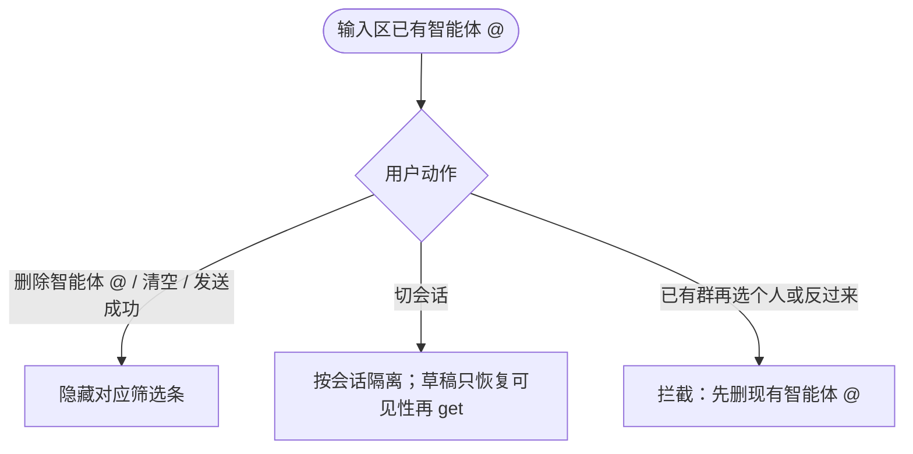

# Spec：安卓端@个人AI框

> 最后更新：2026-07-28  
> 状态：**计划已出（见 plan.md），可开发**  
> 产品目标与 PC / iOS 功能一致；本期只做 **Android**。PC 已决见 `context/features/20260727-at个人AI框-先做pc端/spec.md`；iOS 见 `context/features/20260728-ios端at个人AI框/spec.md`。

## 目标

群聊输入框可 `@个人AI框`；选定后在输入区上方展示**独立**筛选条（知识类型 + DataScope + 时间 + 联网）；发送旁路 `POST /v1/aiRobtChat`，载荷与 PC/iOS 对齐。

## 已决

| 项 | 结论 |
|----|------|
| 场景 | **只做群聊** `@`；私聊不在本功能范围 |
| 产品对齐 | **整表继承** PC / iOS `spec.md` 已决（互斥、列表、工具栏、回复+@、记忆、胶囊文案、可见性等） |
| 实现路径 | 独立个人 AI 筛选条 + `agentKind` 分流挂载（不与群 `GroupChatAgentDataCheckView` 共用实例/状态） |
| 互斥 | 群智能体与个人 AI 同时只能 `@` 一个；合计最多一个 |
| 不可重复 | 已有智能体 `@` 后再输 `@`：列表**不显示**群/个人智能体；仍可 `@人` |
| 工具栏「@智能体」 | **只插群智能体**（现网不变） |
| 回复 + `@` | **需要**：回复后可再 `@` 群或个人 AI；发送带 `referUuid` |
| 类型区分 | **不能只靠 `ga_`（`Constants.AGENT_TYPE`）**——个人 AI 的 accountId 同样 `ga_` 开头。判别：`groupAgentType` 群=`3` / 个人=`0`；插入 `@` 时在 at 模型带 `agentKind: group \| personal`，后续分支只认该字段 |
| agentId 来源（个人） | `group/get` → `groupAgentRels[]` 中 **`accountId === 当前登录人`** 的对象，取其 `agentId` |
| 筛选 UI（个人 AI） | **独立组件**（建议包 `IM/.../dialogue/personal_ai_at/`）；构成：知识类型 + DataScope + 时间 + 联网；深思**无 UI**，按 get 回参透传 save |
| DataScope 显示条件 | 个人条只在 `@` 个人 AI 时挂载；组件内判勾选含 `1` / `2` / `4` 任一 |
| DataScope 空态 | `dataRangeScopeList: null` → `[]`；胶囊「数据+0」 |
| DataScope 选择上限 | **无上限** |
| DataScope 交互 | **直接 start** 现有 `SelectDataRangeActivity`（`personal_ai_select`），传入 `agentId`；不经 bridge、不重写 Picker 核心 |
| DataScope 落库协议 | 对齐 web/iOS：Picker 内 get 返显 + 确认 save；成功后筛选条再 get 刷本地 |
| 胶囊文案 | 知识类型 **「类型+N」**（群 `GroupChatAgentDataCheckView` **同步改**，现网为「数据+N」）；DataScope 保持「数据+N」 |
| getAgentDataRange（个人） | 入参 **`accountId` + `agentId`**；另起方法，勿改群路径的 `belongId` / `belongType` / `aiRoleId` 参数 |
| 筛选记忆逻辑 | 与群智能体一致：条出现时 get；改类型/时间/联网/DataScope 即 save；个人 AI **每次全量**（含 `dataRangeScopeList`） |
| 取消/清空 | 删除智能体 `@` / 清空 / 发送成功 → **立即隐藏**对应筛选条；草稿只恢复可见性，内容再 get |
| 发送载荷 | `POST /v1/aiRobtChat`：`agentId` **群和个人都必传**；`aiRoleId` 两边仍 `'1'`；`dataRangeScopeList` **仅个人**带 |
| 回复可见性 | 个人 AI 回复**群内其他人可见** |
| 与群 AI 框 / AI 框分析 | 不做互斥或联动 |
| `@` 弹窗列表 | 所有人、群智能体、**仅**自己的个人 AI、群成员 |
| 消息身份 / 展示 | `extra.personalAccountId` 有值 → 个人 AI 框；tag「个人AI框」；名/头像优先 `content.user.name` / `portrait`（`extra` 可能为 JSON 字符串须 parse）。详见 `plan-msg-personal-ai-tag.md` |
| 消息回复菜单 | 个人 AI：本人只「@回复」；他人只「回复」。群 AI（`ga_` 无该字段）：仍只「@回复」 |
| 范围 | 本期只 **Android** |
| 错误路径 | get/save 失败仅打日志、不 toast（对齐群） |
| 工程约定 | 少改存量巨型类；新逻辑进功能包；宿主薄挂钩；只 push `personal-ai-chat` |

## 用户流程

### 总览：入口 → 选中 → 筛选 → 发送

```mermaid
flowchart TD
  START([群聊输入区]) --> ENTRY{用户动作}

  ENTRY -->|回复消息| REPLY[显示回复条]
  REPLY --> ENTRY

  ENTRY -->|工具栏「@智能体」| BTN{已有智能体 @?}
  BTN -->|是| BTN_SKIP[不插入]
  BTN -->|否| BTN_GA[只插群智能体]
  BTN_GA --> BAR_GA[显示 GroupChatAgentDataCheckView]

  ENTRY -->|输入 @| AT{已有智能体 @?}
  AT -->|是| LIST_PEOPLE[列表仅所有人/群成员]
  AT -->|否| LIST_FULL[完整列表]

  LIST_FULL --> L1[所有人]
  LIST_FULL --> L2[群智能体 groupAgentRel]
  LIST_FULL --> L3[自己的个人 AI<br/>accountId 匹配]
  LIST_FULL --> L4[群成员…]

  L2 --> FLOW_GA[群智能体流程]
  FLOW_GA --> BAR_GA
  L3 --> FLOW_PA[插入个人 AI @<br/>agentKind=personal]
  FLOW_PA --> BAR_PA[显示个人 AI 筛选条]
  BAR_PA --> FETCH["getAgentDataRange<br/>accountId + agentId"]
  FETCH --> RENDER{勾选含 1/2/4?}
  RENDER -->|是| SCOPE[显示 DataScope 胶囊]
  RENDER -->|否| NOSCOPE[隐藏 DataScope]
  SCOPE -->|点胶囊| PICKER[SelectDataRangeActivity]
  PICKER -->|确认后| REGET[再 get 刷本地]
  NOSCOPE --> TWEAK[调类型/时间/联网 → save]
  REGET --> TWEAK
  BAR_GA --> SEND
  TWEAK --> SEND

  SEND{发送} --> PAYLOAD[IM + aiRobtChat 旁路]
```

### 取消 / 切换



## 共享代码改造点（Android · 必须逐项分支）

> 现网唯一智能体判据是 `userId.startsWith("ga_")` / `Constants.AGENT_TYPE`，个人 AI 同前缀。目标是**群智能体行为不变**，共享点按 `agentKind` 分流。

| 区域 | 现状 | 改造要求 |
|------|------|----------|
| `showGroupAiAgentDataCheckView` / `@` 后是否出条 | 凡 `ga_` 就出群条 | 拆成群 / 个人；分别驱动群条与个人条 |
| `GroupAtFragment` 列表构建 | 已有 `groupAgentRel`；无个人 | 注入 `groupAgentRels` 中自己的个人 AI；带 `agentKind`；已有智能体时两类都不进候选 |
| `GroupListResponse` | 仅 `groupAgentRel` | 补 `groupAgentRels[]`（及 `GroupAgentRelBean` 字段对齐契约） |
| `MentionBlock` / at 模型 | 无 kind | 保留 `agentKind`、`agentId`；草稿无 kind 的 `ga_` 兜底 `group` |
| 工具栏 `btn_at_agent` / `insertAtGroupAgent` | 插群智能体 | 显式 `agentKind=group`；不插个人 |
| `aiRobtChat` 组包（发送旁路） | 核对群路径 `agentId` | **两边都补 `agentId`**；个人额外 `dataRangeScopeList`；`aiRoleId` 维持 `'1'` |
| `GroupChatAgentDataCheckView` 知识类型文案 | 「数据+N」 | 改「类型+N」（群侧同步，需告知测试） |
| 个人筛选 get/save | — | 另起：`accountId + agentId`；独立状态存放，勿改群 `belongId/belongType` 调用 |
| `ConversationLargeInputView` | 同样挂群条 | 与普通输入区对称：按 kind 挂个人条 |
| DataScope | — | start `SelectDataRangeActivity`；确认后筛选条再 get |
| 消息 Cell / 长按菜单 | `ga_` 一律群 AI 展示与菜单 | 按 `extra.personalAccountId` 区分个人/群；见 `plan-msg-personal-ai-tag.md` |

## 本期不做

- web / ios / desktop
- 私聊 `@` 个人 AI
- 深思独立 UI
- 重写 `SelectDataRangeActivity` 核心（挂载所需的最小接线除外）
- 与「群 AI 框 / AI 框分析」互斥联动
- 个人 AI 新建/删除实时推送（`groupAgentRels` 随群 info 拉取即可）
- 推进「选择AI框」里未提交的 `personal_ai_select` 扩展债（本功能只**调用**其 DataScope 入口）

## 依赖

- 契约：`context/contracts/personalAiFrame/getAgentDataRange.d.ts`
- 契约：`context/contracts/personalAiFrame/saveDataRange.d.ts`
- 契约：`context/contracts/personalAiFrame/groupGet.groupAgentRels.d.ts`
- 契约：`context/contracts/personalAiFrame/aiRobtChat.d.ts`
- 现网：`GroupChatAgentDataCheckView`、`GroupAtFragment`、`RongExtension`、`ConversationLargeInputView`、`AiChatBasicInterface`
- DataScope：`smart_message/.../personal_ai_select/SelectDataRangeActivity`
- 平台约定：`context/platforms/android.md`
- 产品对照：`context/features/20260727-at个人AI框-先做pc端/spec.md`、`context/features/20260728-ios端at个人AI框/spec.md`
- 实现逻辑对照（编码时）：iOS `impl-notes.md`（平台无关）

## 各端差异点

| 差异点 | web | android | ios | desktop |
|--------|-----|---------|-----|---------|
| 本期范围 | — | **做** | 另功能已规划/进行中 | 另功能已规划/进行中 |
| DataScope UI | 移动端调原生 Picker；PC 用 H5 弹窗 | **start 已有 SelectDataRangeActivity** | present `ZXPersonalAiPickerController` | PC 自研转发式弹窗 |
| 筛选条 | FilterBar（H5） | **新建独立条**；群继续 `GroupChatAgentDataCheckView` | 独立条 + 群 `ZXAIAgentFilterBar` | 独立 personal 条 |
| 模型缺口 | — | `GroupListResponse` 需补 `groupAgentRels[]` | 已补 | 已有 |

## 实测回参（个人 AI · 与 PC/iOS 同源，2026-07-27）

| 字段 | 实测 |
|------|------|
| `agentId` | 有值；与 `groupAgentRels[].agentId` 一致 |
| `dataRangeList` | 4 项：`3/4/1/2`；均 `choose=1`；无 `0` 内置库 |
| `dataRangeScopeList` | 可为 `null` → 前端 `[]` |
| `timeType` | 默认 `7`（近一周） |
| `netSearch` / `deepThink` | `0` / `0` |

## 待用户确认

- [x] 本 spec 终审通过；`plan.md` 已产出
